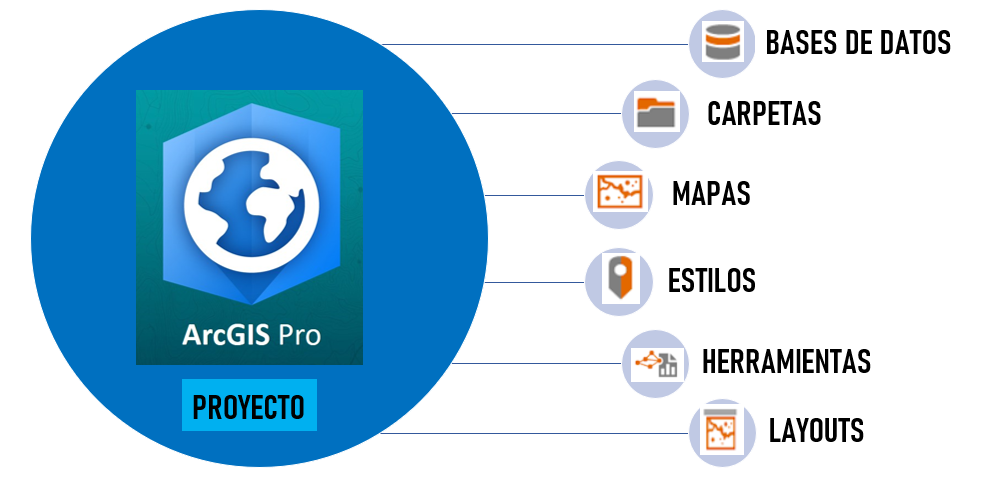
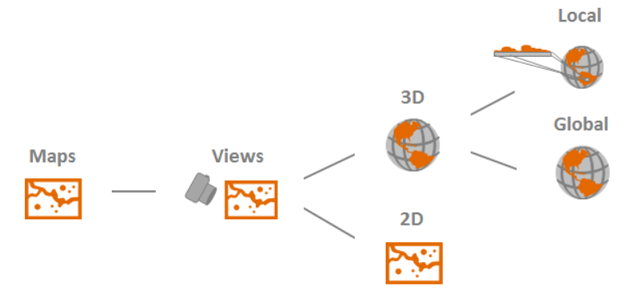
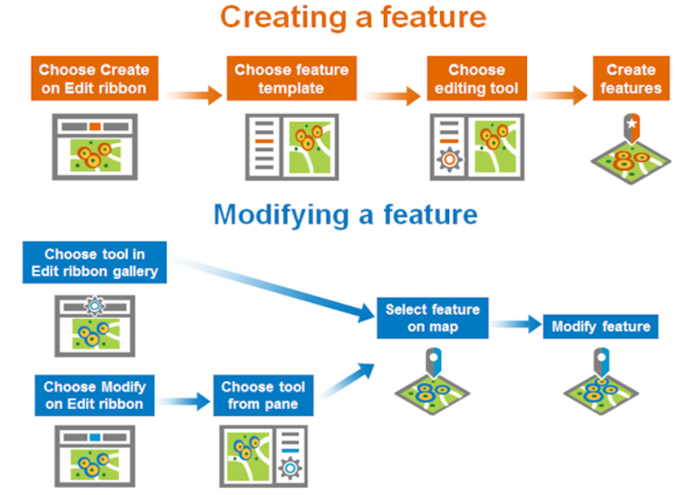
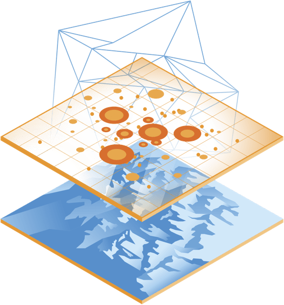

```{r child = "../setup.Rmd"}
```

```{r packages, echo=FALSE, message=FALSE, warning=FALSE}
# AGREGAR PAQUETES A UTILIZAR

```
class: inverse, center, middle

## CLASE 2 
### INTRODUCCIÓN AL USO DE ARCGIS PRO

---

## ¿Qué es ArcGIS Pro?

- ArcGIS Pro es un software, perteneciente a la familia de aplicaciones ArcGIS Desktop de la empresa ESRI, diseñado para la gestión de datos espaciales de manera rápida y eficiente.
- ArcGIS Pro presenta una interfaz moderna y esta diseñado para conectarse a la Web.


  

---

## Estructura de un proyecto

- En ArcGIS Pro se trabaja con una estructura de organización del flujo de trabajo que se denomina proyecto.
- Un proyecto es una colección de elementos relacionados a un objetivo en común, consta de un archivo principal con una extensión ".aprx" y una estructura de carpetas diseñada para contener los datos del proyecto.


  

---

## Vistas de mapa 

- Un proyecto de ArcGIS Pro puede contener múltiples vistas de sus elementos, diferenciados principalmente por el ángulo o zoom seleccionado.
- Los proyectos en ArcGIS pueden contener múltiples mapas, en los cuales podemos visualizar nuestros datos tanto en 2D como en 3D.
- Las vistas de dos o más mapas se pueden vincular.


  

---

class: inverse, center, middle

## EJEMPLO APLICATIVO 01

### CREACIÓN DE UN PROYECTO DE MULTIPLES VISTAS DE LA CUENCA FORTALEZA

---

## Edición 

- La mayoría de datos espaciales requieren actualización debido a la constante modificación del mundo real ocasionada por la interacción hombre-ambiente.
- El flujo de trabajo de la edición en ArcGIS Pro suele ser en su mayoría la creación y modificación de entidades.


  

---

class: inverse, center, middle

## EJEMPLO APLICATIVO 02

### CREACIÓN Y MODIFICACIÓN DE UN SHAPEFILE DE ESTACIONES METEOROLÓGICAS DE LA CUENCA RÍMAC

---

## Análisis

- En los GIS se deben utilizar los datos para resolver problemas o responder preguntas de carácter espacial.
- El análisis suele estar conformado por el uso de herramientas de geoprocesamiento y/o inspecciones visuales de los datos espaciales.


  

---

<br/>


---


---

class: inverse, center, middle

# GRACIAS! <br/>  <a href="mailto: marvinjqs@gmail.com">  </a> 

